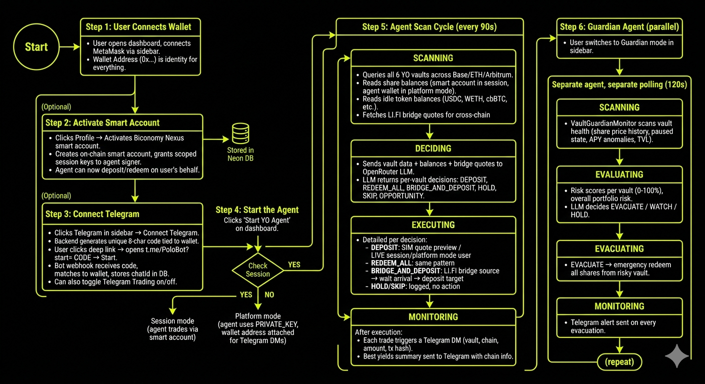

# Polo

Autonomous yield optimization and vault guardian platform built on [YO Protocol](https://yo.xyz). Polo runs AI agents that scan DeFi vaults across chains, make yield decisions, bridge assets cross-chain, and protect capital with emergency redeems, all controllable from a dashboard or Telegram.

## Features

### YO Yielder Agent
- Scans YO Protocol vaults (yoUSD, yoETH, yoBTC, yoEUR, yoGOLD, yoUSDT) across Base, Ethereum, and Arbitrum
- AI decision engine (via OpenRouter) evaluates APY, TVL, idle balances, and bridge opportunities
- Executes deposits, redeems, and cross-chain bridge+deposit via LI.FI SDK
- Supports SIM mode (quote-only) and LIVE mode (real transactions)
- Polls every 90s (configurable)

### Guardian Agent
- Monitors vault health: share price drops, paused state, APY anomalies, low TVL
- Risk scoring per vault with overall portfolio risk gauge
- AI-driven evacuation decisions (EVACUATE / WATCH / HOLD)
- Emergency redeem triggers when vaults become unsafe
- Independent polling cycle (120s default)

### Biconomy Smart Accounts
- Per-user Nexus smart accounts with scoped session keys
- Users delegate deposit/redeem permissions to the platform agent
- Agent trades on behalf of users without holding their funds
- 24-hour session expiry with revoke option
- Session keys scoped to YO Gateway + vault operations on Base

### Telegram Integration
- Users connect Telegram directly from the dashboard sidebar by clicking **Connect Telegram**, which generates a unique verification code and deep link to the bot
- Once linked, the bot sends real-time DMs for every agent event:
  - **Trade alerts** on every deposit, redeem, or bridge+deposit with vault name, chain, amount, and tx hash
  - **Guardian evacuation alerts** when emergency redeems are triggered with risk reason
  - **Best vault yields summary** sent after each scan cycle showing top APYs sorted by return, with chain and token info
  - **Agent start/stop** notifications when the yielder or guardian is toggled

### Telegram Trading
- Users can toggle **Telegram Trading** on/off from the dashboard Telegram settings; toggling sends a confirmation DM to the bot
- When enabled and the user has an active Biconomy session, vault snapshot DMs include inline buttons (Deposit / Redeem) for each vault
- Tapping **Deposit** shows preset amount buttons (e.g. 100 / 500 / 1000 USDC or 0.05 / 0.1 / 0.5 WETH) plus a Max option
- After selecting an amount, a confirmation prompt appears; tapping **Confirm** executes the trade via Biconomy session keys
- The bot edits the message in-place to show the result (tx hash on success, error message on failure)
- Tapping **Redeem** confirms and redeems all shares from the vault
- All trades go through the same Biconomy MEE session keys the user granted from the dashboard, no additional wallet signing required
- Without an active session, DMs still arrive for alerts but trade buttons are hidden

### Dashboard
- Two modes: **Yielder** (yield optimization) and **Guardian** (vault health monitoring)
- Real-time agent state, scan logs, trade history
- Vault APY charts, risk gauges, evacuation history
- SIM/LIVE toggle per agent
- Wallet connection (wagmi v2 + MetaMask/WalletConnect)
- Profile modal for Biconomy smart account onboarding
- Telegram alerts button with trade toggle

## Tech Stack

- **Framework**: Next.js 16, React 19, TypeScript 5
- **Styling**: Tailwind v4, inline styles for dashboard
- **Wallet**: wagmi v2, viem v2
- **Protocol**: @yo-protocol/core, @yo-protocol/react
- **Smart Accounts**: @biconomy/abstractjs (Nexus + MEE)
- **Bridging**: @lifi/sdk
- **Database**: Neon PostgreSQL + Prisma 7
- **AI**: OpenRouter (configurable model)
- **Charts**: recharts

## YO SDK Usage

Polo integrates with [YO Protocol](https://yo.xyz) through `@yo-protocol/core` and `@yo-protocol/react`. Key integration points:

- [`polo/src/lib/yo/yoAgent.ts`](polo/src/lib/yo/yoAgent.ts) — Core agent uses `createYoClient`, `getVaults`, `getShareBalance`, `quotePreviewDeposit`, `prepareDepositWithApproval`, `prepareRedeemWithApproval`, `getTokenBalance`, and `isPaused` to scan all vaults, read positions, and execute trades across chains
- [`polo/src/lib/guardian/monitor.ts`](polo/src/lib/guardian/monitor.ts) — Guardian monitor uses `createYoClient` and `getVaults` to fetch vault stats, then tracks share price history and APY anomalies for risk scoring
- [`polo/src/components/dashboard/shared/Providers.tsx`](polo/src/components/dashboard/shared/Providers.tsx) — Wraps the app with `YieldProvider` from `@yo-protocol/react` (partnerId 9999, 50bps default slippage) and uses `useVaults()` hook for real-time vault data in the dashboard UI

## YO Protocol Vaults

| Vault | Underlying | Address |
|-------|-----------|---------|
| yoUSD | USDC | `0x0000000f2eb9f69274678c76222b35eec7588a65` |
| yoETH | WETH | `0x3a43aec53490cb9fa922847385d82fe25d0e9de7` |
| yoBTC | cbBTC | `0xbcbc8cb4d1e8ed048a6276a5e94a3e952660bcbc` |
| yoEUR | EURC | `0x50c749ae210d3977adc824ae11f3c7fd10c871e9` |

Gateway: `0xF1EeE0957267b1A474323Ff9CfF7719E964969FA` | Partner ID: `9999` | Chain: Base (8453)
